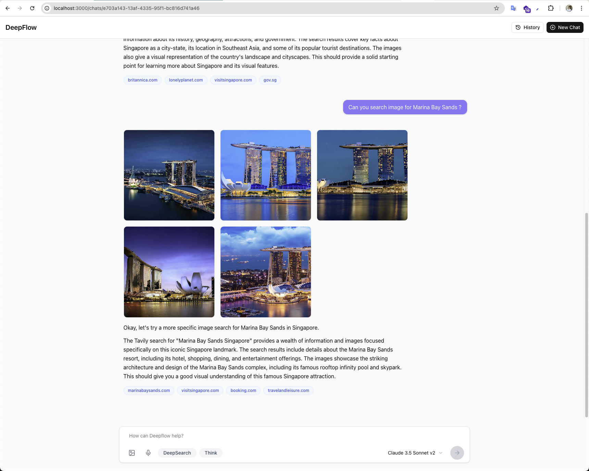

# LLM Tool Flow

A tool flow system that leverages AWS services including Lambda, S3, KnowledgeBase, and optionally SageMaker for LLM inference.



## Setup Instructions

### Prerequisites
- AWS CLI installed and configured
- Terraform installed
- Docker installed (for building and pushing container images)
- Bun.js for running the web application

### Step 1: Configure AWS CLI
```bash
aws configure
```
Enter your AWS Access Key ID, Secret Access Key, default region (ap-southeast-2), and output format (json).

### Step 2: Setup ECR Repositories
```bash
# View available make commands
make help

# Create ECR repositories
make setup-ecr

# If you need to delete ECR repositories
make drop-ecr
```

### Step 3: Setup Terraform Remote State
```bash
# Navigate to the state directory
cd deploy/state

# Comment out the terraform backend block in main.tf
# (lines 45-52 in main.tf)

# Initialize and apply terraform to create S3 bucket and DynamoDB table for state
terraform init
terraform apply

# After successful creation, uncomment the backend block and re-initialize
# to migrate state to S3
terraform init
```

### Step 4: Deploy Infrastructure

```bash
# Navigate to the infrastructure directory
cd deploy/infra/env/prod

# Create or update terraform.tfvars using the following format:
aws_region = "ap-southeast-2"
vpc_name = "LLMToolFlow_vpc"
cidr_block = "10.0.0.0/16"
aurora_name = "llmtoolflow-aurora"
aurora_master_username = "root"
elasticache_enabled = false
elasticache_name = "llmtoolflow-elasticache-redis"
secret_name = "llmtoolflow-envs"
bastion_name = "LLMToolFlow"
ec2_bastion_ingress_ips = ["your-ip-address/32"]
kb_name = "LLMToolFlow_kb"
kb_s3_bucket_name_prefix = "llmtoolflow-kb"
kb_oss_collection_name = "llmtoolflow-kb"
kb_model_id = "amazon.titan-embed-text-v2:0"
s3_bucket_handler_name = "llmtoolflow-handler-files"
lambda_function_handler_name = "llmtoolflow-handler"
lambda_function_ecr_image_uri = "your-account-id.dkr.ecr.ap-southeast-2.amazonaws.com/llmtoolflow-prod-handler-ecr:0.0.6"
sagemaker_enabled = false
sagemaker_name = "llmtoolflow-sagemaker"
sagemaker_ecr_image_uri = "763104351884.dkr.ecr.ap-southeast-2.amazonaws.com/huggingface-pytorch-tgi-inference:2.6.0-tgi3.2.3-gpu-py311-cu124-ubuntu22.04-v2.0"
sagemaker_initial_instance_count = 1
sagemaker_instance_type = "ml.g5.xlarge"
sagemaker_hf_model_id = "meta-llama/Meta-Llama-3.1-8B-Instruct"
sagemaker_hf_access_token = "your-huggingface-token"
sagemaker_tgi_config = {
  max_input_tokens = 4000,
  max_total_tokens = 4096,
  max_batch_total_tokens = 6144,
}

# Deploy shared modules first
terraform init
terraform plan -out=tfplan -target="module.shared"
terraform apply tfplan

# Configure environment variables in AWS Secrets Manager
# Go to AWS Console > Secrets Manager > Find "llmtoolflow-envs" secret
# Update with necessary environment variables

# Deploy handler module
terraform plan -out=tfplan -target="module.handler"
terraform apply tfplan
```

### Step 5: Configure and Run Web Application

```bash
# Copy the API Gateway URL from AWS Lambda Console
# Navigate to the app directory
cd app

# Create .env file with API Gateway URL
echo "API_URL=https://your-api-gateway-url" > .env

# Install dependencies and run the app
bun install
bun run dev
```

### Full Deployment (Building and Deploying Handler)

To build, push, and update the handler Lambda function:

```bash
# Build and push the handler container
make all SERVICE=handler MAJOR=0 MINOR=0

# This will:
# 1. Create a virtual environment and install dependencies
# 2. Run tests (if any)
# 3. Build the container image
# 4. Push to ECR
# 5. Update terraform.tfvars with the new image URI
```

After pushing a new image, update the Lambda function:

```bash
cd deploy/infra/env/prod
terraform plan -out=tfplan -target="module.handler"
terraform apply tfplan
```

## Architecture

The system uses several AWS services:
- API Gateway and Lambda for backend processing
- S3 for file storage
- Amazon Bedrock or SageMaker for LLM inference
- AWS Knowledge Base for document storage and retrieval
- Aurora PostgreSQL for database storage (optional)
- ElastiCache for Redis caching (optional)

## Web Application

The web application is built with Next.js and provides a simple interface for interacting with the tool flow system.
